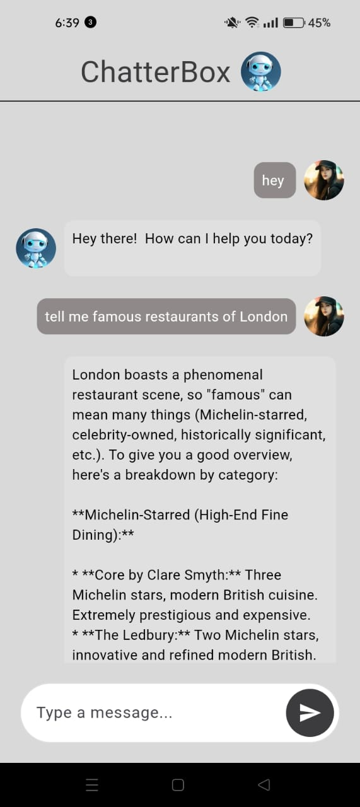
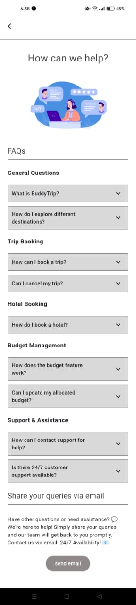

# BuddyTrip  


## 📌 Introduction  
**BuddyTrip** is a travel companion app that allows users to:  
- **Book hotels** conveniently.  
- **Track expenses** and manage budgets.  
- **Get travel tips** and guidance.  
- **Share feedback** and queries via email.  

## 🛠️ Tech Stack  
- **Frontend**: Flutter  
- **Backend & Database**: Firebase  
- **APIs**: OpenWeatherMap API, Wikipedia API, Gemini API  
- **Email Integration**: URL Launcher Package
- **Animations**: Lottie Json Files
- **Logo**: Canva
- **UI Design**: Figma [Visit Design Repository](https://github.com/Javaria-Shabbir24/BuddyTrip)

## 🚀 App Workflow  
1. **Onboarding Screens**:  
   - Sliding transition to welcome users.  
2. **User Authentication**:  
   - Create an account.  
   - Reset password if needed.  
   - Login redirects to the home page.  
3. **Search & Explore**:  
   - Search for a destination.  
   - View a detailed description, popular attractions, and real-time weather.  
   - Data fetched via OpenWeatherMap & Wikipedia APIs.  
4. **Popular Spots Carousel**:  
   - View top tourist spots on the home screen.  
5. **Hotel Booking**:  
   - Select a destination, pick dates, and book rooms.  
   - Firebase stores booking details.  
6. **Expense Tracking & Budget Management**:  
   - Manually update transportation, clothing, and miscellaneous budgets.  
   - Real-time budget updates via Firebase.  
   - **Pie chart visualization** for better insights.  
7. **Chatter Box (AI Chatbot)**:  
   - Provides travel guidance.  
   - Built using **Gemini API**.  
8. **About Page**:  
   - Displays app features.  
   - Users can submit feedback.  
9. **Help Page**:  
   - Includes animations & FAQs.  
   - Users can send queries via email using the **URL Launcher Package**.  
10. **User Profile Management**:  
    - Update profile picture, phone number, and gender.  
11. **Logout Feature**:  
    - Securely log out from the app.  

## 📸 Screenshots  






 

## 📦 Installation  
1. Clone the repository:  
   ```sh
   git clone https://github.com/Javaria-Shabbir24/buddytrip.git
   cd buddytrip
